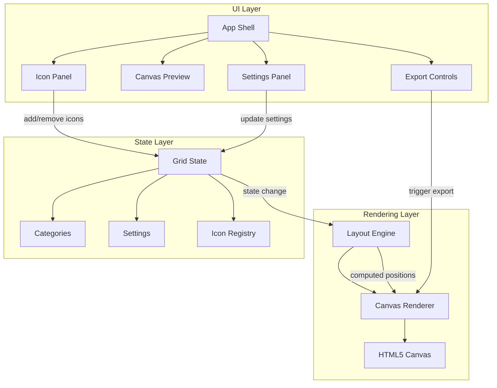

# Design Document: Icon Grid Generator

## Overview

The Icon Grid Generator is a static client-side React TypeScript application built with Vite. It allows users to compose icon/logo grid images by searching the Devicons library, arranging icons into categorized groups, customizing layout and appearance, and exporting the result as PNG or JPEG.

All rendering happens in the browser using the HTML5 Canvas API. The application fetches SVG icons from the Devicons CDN (`cdn.jsdelivr.net/gh/devicons/devicon`), rasterizes them onto a canvas, and provides real-time preview with export capabilities.

### Key Design Decisions

1. **Canvas API over DOM rendering** — The grid is rendered on a `<canvas>` element for pixel-perfect export. The UI controls (panels, buttons) use standard React components.
2. **@dnd-kit for drag and drop** — A well-maintained, accessible, and performant React DnD library that supports sortable grids and multiple containers (categories).
3. **Devicon JSON manifest for search** — The app fetches `devicon.json` from the CDN at startup to populate the searchable icon list, avoiding the need for a backend.
4. **State-driven rendering** — All canvas rendering is derived from a central state object. Any state change triggers a re-render of the canvas.

## Architecture



### Component Architecture

The application follows a unidirectional data flow:

1. **UI components** dispatch actions that modify state
2. **State** is managed via React context + useReducer
3. **Layout Engine** computes positions from state (pure function)
4. **Canvas Renderer** draws the computed layout onto the canvas

## Components and Interfaces

### UI Components

| Component | Responsibility |
|-----------|---------------|
| `App` | Root layout shell, provides state context |
| `IconPanel` | Search input, filtered icon list, add-to-grid action |
| `CanvasPreview` | Hosts the `<canvas>` element, handles zoom/scroll |
| `SettingsPanel` | Icon size slider, label toggle/position, background toggle |
| `ExportControls` | Format selection (PNG/JPEG), download button |
| `CategoryManager` | Create/rename/delete/reorder categories |
| `GridEditor` | Drag-and-drop icon arrangement within/across categories |
| `IconCard` | Individual icon in the grid editor with remove button |

### Core Modules

| Module | Responsibility |
|--------|---------------|
| `layoutEngine` | Computes icon positions, category headers, spacing |
| `canvasRenderer` | Draws icons, labels, headers, background onto canvas |
| `iconFetcher` | Fetches and caches SVG icons from Devicons CDN |
| `exportModule` | Converts canvas to PNG/JPEG blob and triggers download |
| `deviconSearch` | Loads devicon.json manifest, provides fuzzy search |

### Key Interfaces

```typescript
interface IconEntry {
  id: string;           // unique instance id (uuid)
  name: string;         // devicon name (e.g., "react")
  displayName: string;  // human-readable name (e.g., "React")
  svgUrl: string;       // CDN URL for the SVG
  variant: string;      // e.g., "original", "plain"
}

interface Category {
  id: string;           // unique id
  name: string;         // display name / header text
  iconIds: string[];    // ordered list of IconEntry ids
}

interface GridSettings {
  iconSize: number;         // 32–256 pixels
  labelEnabled: boolean;
  labelPosition: 'above' | 'below';
  labelFontSize: number;    // in pixels
  background: 'white' | 'transparent';
  padding: number;          // spacing between icons
  categorySpacing: number;  // vertical space between category sections
}

interface GridState {
  categories: Category[];
  icons: Record<string, IconEntry>;  // icon registry by id
  settings: GridSettings;
}
```

### Layout Engine Interface

```typescript
interface LayoutResult {
  canvasWidth: number;
  canvasHeight: number;
  elements: LayoutElement[];
}

type LayoutElement =
  | { type: 'icon'; iconId: string; x: number; y: number; size: number }
  | { type: 'label'; text: string; x: number; y: number; fontSize: number }
  | { type: 'categoryHeader'; text: string; x: number; y: number; fontSize: number };

function computeLayout(state: GridState): LayoutResult;
```

### Export Module Interface

```typescript
interface ExportOptions {
  format: 'png' | 'jpeg';
  quality?: number;  // 0–1 for JPEG
}

function exportCanvas(canvas: HTMLCanvasElement, options: ExportOptions): void;
```

## Data Models

### Devicon Manifest Entry (from CDN)

```typescript
interface DeviconEntry {
  name: string;
  altnames: string[];
  tags: string[];
  versions: {
    svg: string[];   // e.g., ["original", "plain", "line"]
    font: string[];
  };
  color: string;
  aliases: Array<{ base: string; alias: string }>;
}
```

The manifest is fetched once from `https://raw.githubusercontent.com/devicons/devicon/master/devicon.json` and cached in memory. SVG URLs follow the pattern:
```
https://cdn.jsdelivr.net/gh/devicons/devicon/icons/{name}/{name}-{variant}.svg
```

### Application State Shape

```typescript
interface AppState {
  grid: GridState;
  search: {
    query: string;
    results: DeviconEntry[];
  };
  ui: {
    draggingIconId: string | null;
    isExporting: boolean;
  };
}
```

### Icon Image Cache

Fetched SVG images are rasterized to `ImageBitmap` objects and stored in a `Map<string, ImageBitmap>` keyed by SVG URL. This avoids re-fetching and re-rasterizing on every canvas render.

### Persistence

No server-side persistence. The application state lives in memory for the session. Future enhancement could add localStorage persistence, but it is out of scope for the initial implementation.

## Correctness Properties

*A property is a characteristic or behavior that should hold true across all valid executions of a system — essentially, a formal statement about what the system should do. Properties serve as the bridge between human-readable specifications and machine-verifiable correctness guarantees.*

### Property 1: Search filter returns only matching results

*For any* query string and icon manifest, every icon returned by the search filter must contain the query as a case-insensitive substring of its name, altnames, or tags. No icon that matches should be excluded from the results.

**Validates: Requirements 1.1**

### Property 2: Adding an icon grows the target category

*For any* grid state and any valid icon selection, adding the icon to the active category results in that category's icon list growing by exactly one, and the new icon appearing in the list.

**Validates: Requirements 1.2**

### Property 3: Reordering icons within a category is a valid permutation

*For any* category with icons and any valid source/destination index pair, reordering produces a list that is a permutation of the original (same elements, same count) with the moved item at the destination index.

**Validates: Requirements 2.1**

### Property 4: Moving an icon between categories preserves total count

*For any* grid state with multiple categories, moving an icon from one category to another results in the source category losing exactly one icon, the destination gaining exactly one icon, and the total icon count across all categories remaining unchanged.

**Validates: Requirements 2.2**

### Property 5: Category creation adds to the category list

*For any* grid state and any valid category name, creating a new category results in the categories list growing by one and containing a category with the specified name.

**Validates: Requirements 3.1**

### Property 6: Category rename updates only the target category name

*For any* grid state with categories and any valid new name, renaming a category updates that category's name while leaving all other categories and all icon assignments unchanged.

**Validates: Requirements 3.2**

### Property 7: Category deletion removes the category and its icons

*For any* grid state, deleting a category removes it from the categories list and removes all icons that belonged exclusively to that category from the icon registry.

**Validates: Requirements 3.3**

### Property 8: Layout engine positions categories in distinct vertical sections

*For any* grid state with multiple categories, the computed layout places each category header above its icons, and no two categories overlap vertically (each category's bounding box is disjoint from others).

**Validates: Requirements 3.4**

### Property 9: Category reordering is a valid permutation

*For any* category list and valid reorder operation, the result is a permutation of the original categories (same elements, same count, different order).

**Validates: Requirements 3.5**

### Property 10: All icons rendered at specified square size

*For any* grid state with an icon size setting between 32 and 256, all icon elements in the computed layout have both width and height equal to the specified size.

**Validates: Requirements 4.1, 4.3**

### Property 11: Icon size validation enforces bounds

*For any* numeric value, the icon size setting accepts values in [32, 256] and rejects or clamps values outside this range.

**Validates: Requirements 4.2**

### Property 12: Labels match icons in count and content

*For any* grid state with labels enabled, the computed layout contains exactly one label element per icon element, and each label's text matches its corresponding icon's display name, rendered at the configured font size.

**Validates: Requirements 5.1, 5.3**

### Property 13: Label position is correct relative to its icon

*For any* grid state with labels enabled and position set to "above", every label's Y coordinate is less than its icon's Y coordinate. When position is "below", every label's Y coordinate is greater than its icon's Y coordinate plus icon size.

**Validates: Requirements 5.2**

### Property 14: Labels do not overlap icons

*For any* grid state with labels enabled, no label's bounding box intersects with any icon's bounding box in the computed layout.

**Validates: Requirements 5.4**

### Property 15: Icon removal decreases count and removes from all categories

*For any* grid state containing at least one icon, removing an icon results in the total icon count decreasing by one and the icon no longer appearing in any category's icon list.

**Validates: Requirements 9.1**

## Error Handling

### Network Errors (Icon Fetching)

| Scenario | Handling |
|----------|----------|
| Devicon manifest fetch fails | Display error message, allow retry. App remains usable with empty icon library. |
| Individual SVG fetch fails | Show placeholder/broken icon indicator in the grid. Allow user to remove and re-add. |
| Slow network / timeout | Show loading spinner per icon. Timeout after 10 seconds with retry option. |

### Invalid User Input

| Scenario | Handling |
|----------|----------|
| Icon size outside 32–256 | Clamp to nearest valid value (32 or 256) |
| Empty category name | Prevent creation, show inline validation message |
| Duplicate category name | Allow (categories are identified by ID, not name) |
| Empty search query | Show all icons (no filter applied) |

### Canvas Rendering Errors

| Scenario | Handling |
|----------|----------|
| Canvas context unavailable | Display fallback message indicating browser incompatibility |
| SVG fails to rasterize | Skip that icon in render, show placeholder in grid editor |
| Export fails (toBlob returns null) | Show error toast, suggest trying a different format |

### State Consistency

- All state mutations go through the reducer, ensuring atomic updates
- If an icon is referenced by a category but missing from the registry, it is skipped during layout computation
- Drag-and-drop operations are validated before applying (valid source/destination indices)

## Testing Strategy

### Unit Tests

Unit tests cover specific examples, edge cases, and integration points:

- **Search module**: Empty query returns all, special characters in query, no results case
- **State reducer**: Each action type with concrete examples
- **Export module**: Correct MIME types, filename pattern, JPEG transparency handling
- **Icon fetcher**: URL construction from devicon name + variant

### Property-Based Tests

Property-based tests verify universal correctness properties using [fast-check](https://github.com/dubzzz/fast-check) (TypeScript PBT library).

**Configuration:**
- Minimum 100 iterations per property test
- Each test tagged with: `Feature: icon-grid-generator, Property {number}: {property_text}`

**Target modules:**
- `deviconSearch` — Property 1 (search filter correctness)
- State reducer — Properties 2, 3, 4, 5, 6, 7, 9, 11, 15 (state mutations)
- `layoutEngine` — Properties 8, 10, 12, 13, 14 (layout computation)

**Generators needed:**
- `arbitraryGridState` — generates valid GridState with random categories and icons
- `arbitraryIconEntry` — generates valid IconEntry instances
- `arbitraryCategory` — generates valid Category with random icon IDs
- `arbitraryGridSettings` — generates valid GridSettings within constraints
- `arbitrarySearchQuery` — generates random search strings
- `arbitraryDeviconManifest` — generates random DeviconEntry arrays

### Integration Tests

- Canvas rendering produces expected pixel output for known inputs
- Export triggers browser download with correct file
- Drag-and-drop interactions update state correctly via @dnd-kit

### Manual Testing

- Visual verification of canvas output quality
- Drag-and-drop UX smoothness
- Responsive layout at various viewport sizes
- Cross-browser canvas rendering consistency

