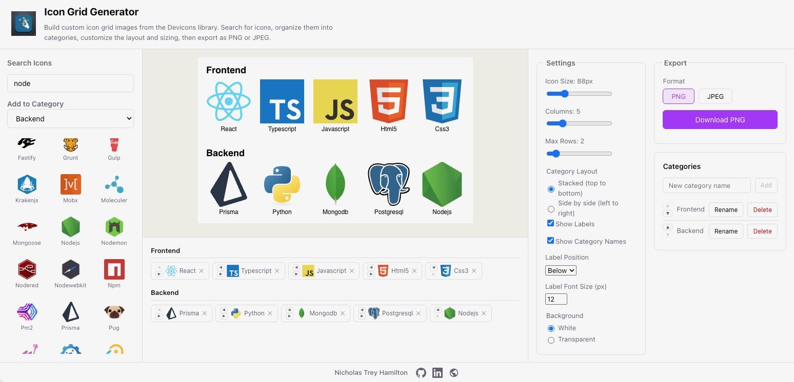
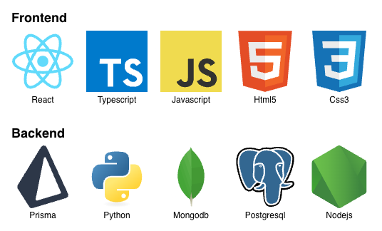

# Icon Grid Generator

A simple browser tool for building icon grid images. Pick icons from the Devicons library, organize them into categories, tweak the layout, and export the result as a PNG or JPEG. Everything runs client-side, no backend needed.

**Live demo:** [https://hamiltonnbc.github.io/Icon-image-generator/](https://hamiltonnbc.github.io/Icon-image-generator/)

## What it looks like



Here's the main interface. From left to right:

- **Icon Library (left sidebar)** - Search the full Devicons collection and pick a target category before clicking to add
- **Canvas Preview (center top)** - Live preview of your grid that updates as you make changes
- **Icon List (center bottom)** - All your added icons grouped by category, with reorder and remove controls
- **Settings (right, left column)** - Icon size, columns, max rows, category layout direction, labels, and background options
- **Export + Categories (right, right column)** - Download as PNG/JPEG, and manage your categories (create, rename, delete, reorder)

## Example export

Here's what an exported icon grid looks like:



## Running locally

```bash
npm install
npm run dev
```

Then open [http://localhost:5173](http://localhost:5173).

## Building

```bash
npm run build
```

Output goes to `dist/`.

## Tech stack

- React + TypeScript + Vite
- HTML5 Canvas API for rendering and export
- Devicons CDN for the icon library

## Author

**Nicholas Trey Hamilton**

[](https://github.com/hamiltonnBC)
[](https://www.linkedin.com/in/nicholas-trey-hamilton/)
[](https://nicholastreyhamilton.com)
